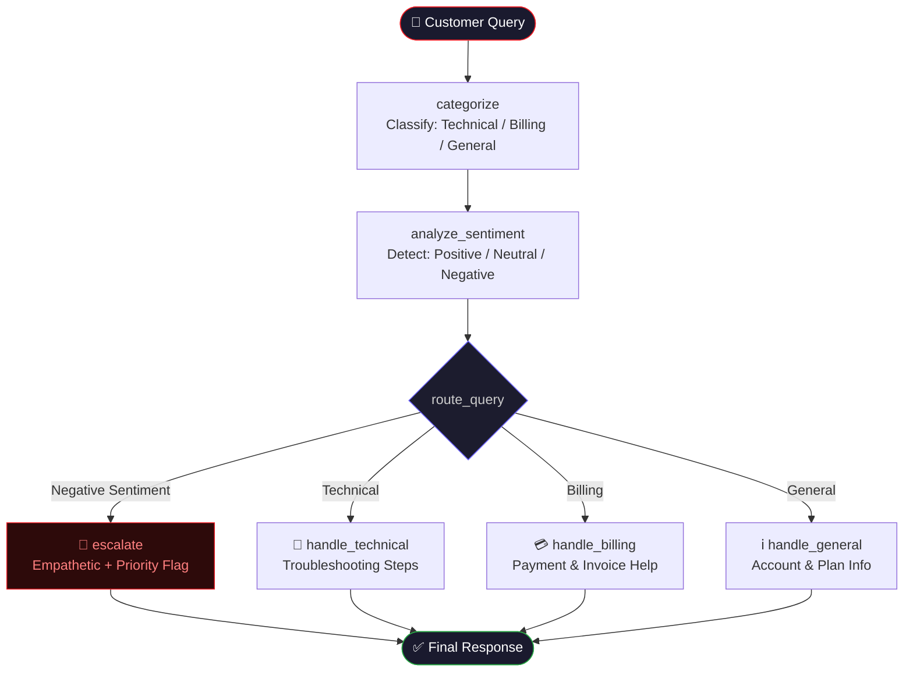

<div align="center">

# 📡 Airtel AI Customer Support Agent

<p align="center">
  
  
  
  
  
</p>

<p align="center">
  An intelligent, <strong>LangGraph-powered</strong> AI customer support agent for Airtel — capable of classifying queries, detecting sentiment, routing to specialized handlers, and escalating frustrated customers, all through a sleek <strong>ChatGPT-style</strong> Streamlit interface.
</p>

</div>

---

## 📌 Table of Contents

- [About the Project](#-about-the-project)
- [Key Features](#-key-features)
- [System Architecture](#-system-architecture)
- [Agent Workflow](#-agent-workflow)
- [Project Structure](#-project-structure)
- [Tech Stack](#-tech-stack)
- [Getting Started](#-getting-started)
- [Running the App](#-running-the-app)
- [Airtel Support Channels](#-airtel-support-channels)
- [Dependencies](#-dependencies)
- [Security](#-security)
- [License](#-license)

---

## 🧩 About the Project

The **Airtel AI Customer Support Agent** is a production-ready, multi-node agentic AI system that simulates a fully autonomous customer support desk for Airtel — one of India's largest telecom providers.

Built on top of **LangGraph** (a framework for building stateful, graph-based AI agents) and **Groq's ultra-fast LLM inference**, this system:

- Understands what the customer is asking *(categorization)*
- Understands how the customer feels *(sentiment analysis)*
- Decides the best path to resolve the issue *(intelligent routing)*
- Responds with accurate, empathetic, and actionable answers

The frontend is a polished **dark-mode chat UI** built with Streamlit, designed to feel like a premium support product — not a prototype.

---

## ✨ Key Features

| Feature | Description |
|---|---|
| 🔍 **Query Categorization** | Classifies queries as `Technical`, `Billing`, or `General` using an LLM |
| 😊 **Sentiment Analysis** | Detects customer sentiment: `Positive`, `Neutral`, or `Negative` |
| 🤖 **Smart Routing** | Dynamically routes each query to the most appropriate handler node |
| 🚨 **Escalation Handling** | Negative-sentiment queries receive empathetic, priority-flagged responses |
| 💬 **Conversational UI** | ChatGPT/Claude-style dark-mode chat interface with message history |
| ⚡ **Groq-Powered** | Uses Groq for sub-second LLM inference |
| 🏷️ **Response Tags** | Each response is labelled with its detected category and sentiment |

---

## 🏗️ System Architecture

The application is split into two clean layers:

```
┌──────────────────────────────────────────────────────┐
│                   FRONTEND LAYER                      │
│          Streamlit Chat UI  (frontend/app.py)         │
│   • Message history  • Response tags  • Dark theme   │
└─────────────────────┬────────────────────────────────┘
                      │  calls run_customer_support()
┌─────────────────────▼────────────────────────────────┐
│                    AGENT LAYER                        │
│           LangGraph State Machine  (agent.py)         │
│                                                       │
│   State: { query, category, sentiment, response }     │
│                                                       │
│   ┌──────────┐    ┌──────────────────┐               │
│   │categorize│───►│ analyze_sentiment │               │
│   └──────────┘    └────────┬─────────┘               │
│                            │ route_query()            │
│          ┌─────────────────┼──────────────┐          │
│          ▼                 ▼              ▼           │
│   [handle_billing] [handle_technical] [handle_general]│
│                                                       │
│          ──── OR (if Negative sentiment) ────         │
│                       [escalate]                      │
└──────────────────────────────────────────────────────┘
                      │
              ┌───────▼───────┐
              │   Groq  LLM   │
              │  (inference)  │
              └───────────────┘
```

---

## 🔄 Agent Workflow

The core agent is a **directed state graph** built with LangGraph. Each node is a specialized LLM-powered function. The graph executes deterministically based on the customer's query.



### Node Descriptions

| Node | Role | LLM Behavior |
|---|---|---|
| `categorize` | Query classifier | Returns exactly one word: `Technical`, `Billing`, or `General` |
| `analyze_sentiment` | Sentiment detector | Returns exactly one word: `Positive`, `Neutral`, or `Negative` |
| `route_query` | Conditional router | Pure Python — no LLM call, routes based on state values |
| `handle_technical` | Technical support | Provides step-by-step troubleshooting using Airtel's channels |
| `handle_billing` | Billing support | Assists with bills, payments, disputes, and receipts |
| `handle_general` | General support | Answers account, plan, and Airtel service inquiries |
| `escalate` | Escalation handler | Acknowledges frustration, solves the issue, and flags for priority review |

---

## 🗂️ Project Structure

```
airtel-support-agent/
│
├── 📄 agent.py                  # LangGraph workflow & all agent nodes
├── 📁 frontend/
│   └── 📄 app.py                # Streamlit dark-mode chat UI
├── 📄 requirements.txt          # Python package dependencies
├── 📄 .env                      # Environment variables (API keys — not committed)
├── 📄 .gitignore                # Git ignore rules
└── 📄 README.md                 # Project documentation
```

---

## 🛠️ Tech Stack

| Layer | Technology | Purpose |
|---|---|---|
| **Agent Framework** | [LangGraph](https://github.com/langchain-ai/langgraph) | Stateful, graph-based agent orchestration |
| **LLM Provider** | [Groq](https://groq.com/) | Ultra-fast LLM inference |
| **LLM Integration** | [LangChain](https://python.langchain.com/) | Prompt templates, chains, and model wrappers |
| **Frontend** | [Streamlit](https://streamlit.io/) | Interactive web-based chat UI |
| **Config** | [python-dotenv](https://pypi.org/project/python-dotenv/) | Secure API key management |
| **Language** | Python 3.9+ | Core application language |

---

## 🚀 Getting Started

### Prerequisites

- Python **3.9 or higher**
- A free **Groq API key** — [Get one here](https://console.groq.com)

### 1. Clone the repository

```bash
git clone https://github.com/your-username/airtel-support-agent.git
cd airtel-support-agent
```

### 2. Create a virtual environment

```bash
python -m venv venv
```

Activate it:

```bash
# Windows
venv\Scripts\activate

# macOS / Linux
source venv/bin/activate
```

### 3. Install dependencies

```bash
pip install -r requirements.txt
```

### 4. Set up environment variables

Create a `.env` file in the project root:

```env
GROQ_API_KEY=your_groq_api_key_here
```

> **Note:** Never commit your `.env` file. It is already included in `.gitignore`.

---

## ▶️ Running the App

```bash
streamlit run frontend/app.py
```

Open your browser and navigate to:

```
http://localhost:8501
```

### Example Queries to Try

| Query | Expected Routing |
|---|---|
| `"My internet is not working since morning"` | Technical → handle_technical |
| `"I was charged twice for my plan"` | Billing → handle_billing |
| `"What are the latest Airtel prepaid plans?"` | General → handle_general |
| `"This is ridiculous, fix my connection now!"` | Negative → escalate |

---

## 📞 Airtel Support Channels

The agent is aware of all official Airtel support channels and uses them in its responses:

| Channel | Details |
|---|---|
| 📱 **Airtel Thanks App** | Run diagnostics, check network status, raise complaints, pay bills |
| 🌐 **Official Website** | [https://www.airtel.in](https://www.airtel.in) |
| 📞 **Customer Care** | `121` (from Airtel number) · `198` (toll-free for outages) |
| 💳 **Bill Pay Portal** | [https://www.airtel.in/billpay](https://www.airtel.in/billpay) |
| 🐦 **Social Media** | [@airtelindia](https://twitter.com/airtelindia) on Twitter/X |

---

## 📦 Dependencies

```txt
langchain          # LLM framework and prompt templating
langgraph          # Graph-based agent orchestration
langchain-groq     # Groq LLM provider integration
langchain-core     # Core abstractions for LangChain
langchain-community # Community tools and loaders
streamlit          # Web UI framework
python-dotenv      # .env file loader
langchain_tavily   # Tavily web search tool
feedparser         # RSS/Atom feed parsing
duckduckgo-search  # DuckDuckGo search integration
reportlab          # PDF report generation
```

Install all at once:

```bash
pip install -r requirements.txt
```

---

## 🔒 Security

- **API keys** are stored in `.env` and are **never hardcoded** in source files
- The `.env` file is listed in `.gitignore` and will **not be tracked by Git**
- Before pushing to a public repository, verify no secrets are exposed:

```bash
git diff --cached  # Review staged changes before committing
```

---

## 📄 License

This project is intended for **educational and demonstration purposes**.  
Feel free to fork, modify, and build upon it.

---

<div align="center">

**Built with ❤️ using [LangGraph](https://github.com/langchain-ai/langgraph) · [Groq](https://groq.com/) · [Streamlit](https://streamlit.io/)**

*Airtel AI Customer Support Agent — Intelligent. Fast. Empathetic.*

</div>
